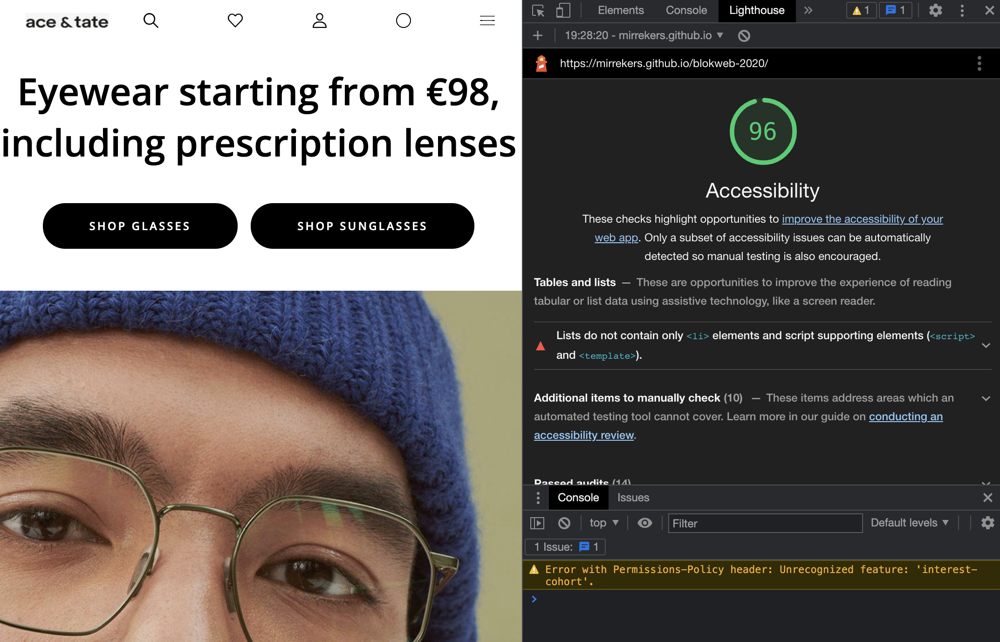
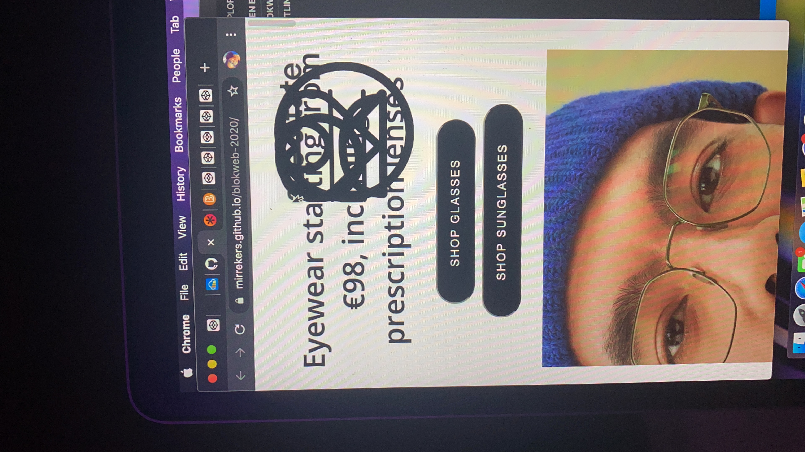
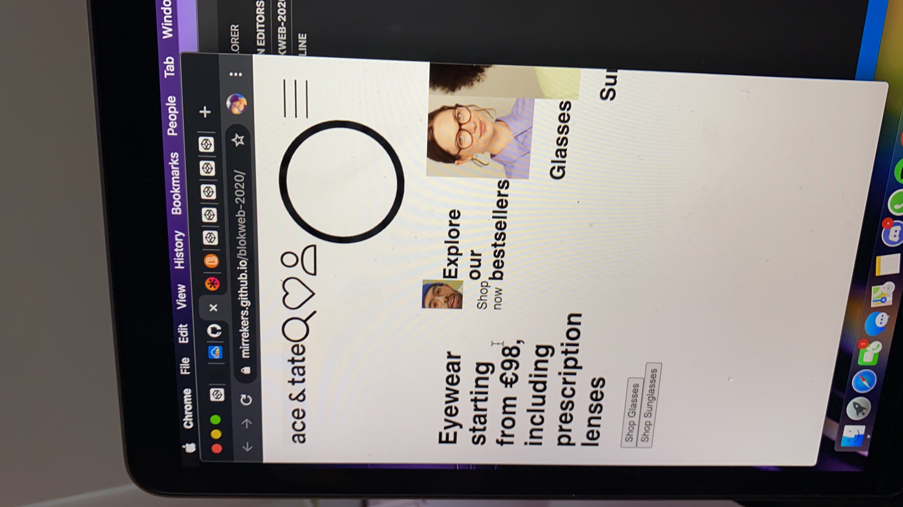

# Procesverslag
**Auteur:** Mirre Kerssenberg

## Bronnenlijst

1. https://developer.mozilla.org/en-US/docs/Web/CSS/CSS_Flexible_Box_Layout/Mastering_Wrapping_of_Flex_Items
2. https://css-tricks.com/snippets/css/a-guide-to-flexbox/
3. https://stackoverflow.com/questions/6939864/what-is-the-difference-between-section-and-div
4. https://stackoverflow.com/questions/19108112/show-image-over-another-image-on-hover
5. https://developer.mozilla.org/en-US/docs/Web/CSS/CSS_Flexible_Box_Layout/Basic_Concepts_of_Flexbox
6. https://css-tricks.com/snippets/css/complete-guide-grid/
7. https://stackoverflow.com/questions/33828542/how-to-make-the-input-text-wider
8. https://www.w3schools.com/howto/howto_css_placeholder.asp
9. https://developer.mozilla.org/en-US/docs/Web/API/Document/getElementsByClassName
10. https://stackoverflow.com/questions/40891570/show-button-on-hover-only

## Herkansing 2021 
-Ik moest van vorig jaar alleen animatie zeker aanpassen om het net te halen. wat ik heb gedaan in de weken dit jaar zijn:

De navigatie proberen te verbeteren. Mijn logo was beetje squished.

Het meer accessible maken voor ander soort gebruikers.

Een animatie/Microinteractie toevoegen

De design verbeteren en beter de puntjes op de i doen.
.-

## Accessibility

## Eindgesprek (week 7/8)

-Ik heb heel veel gepuzzeld met de html opbouw, ik moest er nog even inkomen weer na zolang niet te hebben gebruikt. Met behulp van de codepen opdachten had ik alvast een start gemaakt met hoe het daar aangewezen werd en later werd ik erop aangewezen hoe het moet. Ik had vooral veel problemen met de navigatie. heb vaker mn code gebroken denkende dat ik de navigatie goed had. Uiteindelijk had ik hem wel bovenaan gekregen. Verder was grid uitzoeken best lang, heb alles zoeen beetje getest tot ik kreeg wat ik zocht, zelfde geld voor flexbox. Uiteidelijk is het wel gelukt en snap ik het wel meer. uiteindelijk is het enige waar ik niet trots op ben de navigatie, maar er was tijdnood en ik wou wel de basis erin hebben dus dat ging voor.-

**Screenshot(s):**

-screenshot(s) van je eindresultaat-

## Voortgang 3 (week 6)
- probeer flexbox inplaats van grid bij de tweede pagina
- en grid bij de feed
- zitten stukjes onnodige code tussen
- comments plaatsen

## Voortgang 2 (week 5)

- Bij linkjes als die nergens naar toegaat #
Html chaotisch - HTML FORMATTER
- Bij images alt veranderen
- Li naar sections 
- id naar class
- footer ook oplossen met een section 
- form geen get maar post request
- font size in em 
- Onnodige li's en ul's weghalen
- sections gebruiken

## Voortgang 1 (week 3)
Niet aanwezig: Ziek

### Stand van zaken
Het is moeilijk om te beginnen, ik ben veel later begonnen met werklen eraan, maar het gaat nu best smooth.
gewoon heel veel terug gaan op wat al gemaakt is met een betere oplossingen.

**Screenshot(s):**

## Intake (week 1)

**Je startniveau:** -blauw-
** Mijn start niveau is blauw, ben niet zo geweldig in code. Ik heb eerder problemen gehad met inleiding programmeren, html en css lukte wel.**

**Je focus:** -kies uit responsive óf surface plane-
** Ik zal mij meer richten op de surface plane van de website. Als het goed gaat kan ik kijken voor responsive maar ik richt mij nu vooral op de surface plane**

**Je opdracht:** -link naar de website die je gaat namaken óf de naam van je eigen ontwerp-
** https://www.aceandtate.com/nl-en/
**Screenshot(s):**

**Breakdown-schets(en):**

